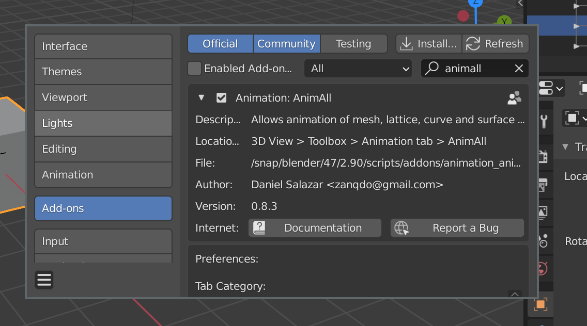
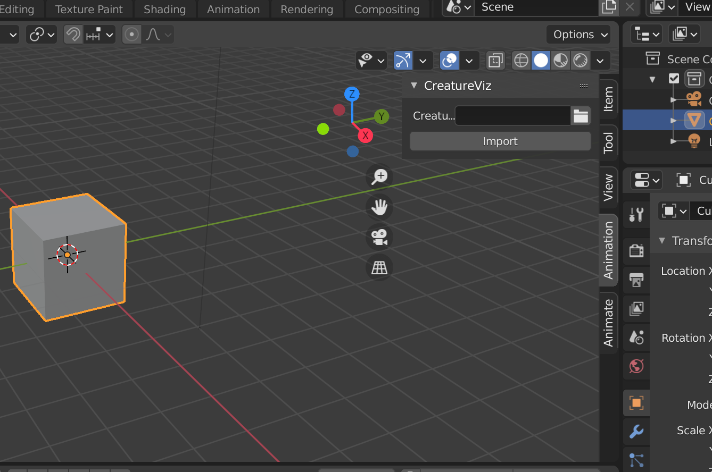

# Coevolution of Morphology and Policy Implicit Neural Functions

### [Project Page](http://www.haquochuy.com/soft-creatures/) | [Video](https://youtu.be/Hk5GLJ9AqAU)


## Setup

First, get the code

```
git clone https://github.com/huy-ha/coevolving-neural-networks.git
```

Then compilation is just your typical
```
mkdir build
cd build
cmake ..
make -j$(nproc)
```

## Evolution

To run the evolution
```
src/evolutionary/Solve
```

## Quick actions

You can quickly generate and simulate a random creature with
```
build/demo
```

You can also see the effect of random mutations to the policy
```
build/creature/MutateDemo
```

If you already have a creature JSON file, and you just want to run its simulation
```
build/creature/CreatureVisualizer <path-to-json>
```

## Visualizing simulations

After you get the simulation result `.sim`, you can import it into Blender for visualization with
```
blender --python creature-visualizer.py
```

This will launch Blender with the creature visualizer plugin installed.
Make sure you enable the AnimAll add-on.


The plugin wraps the import functionality into one command, so you just need to navigate to the `.sim` simulation output file, and click `Import`.


Playing around with the materials and lighting will get you something like this
